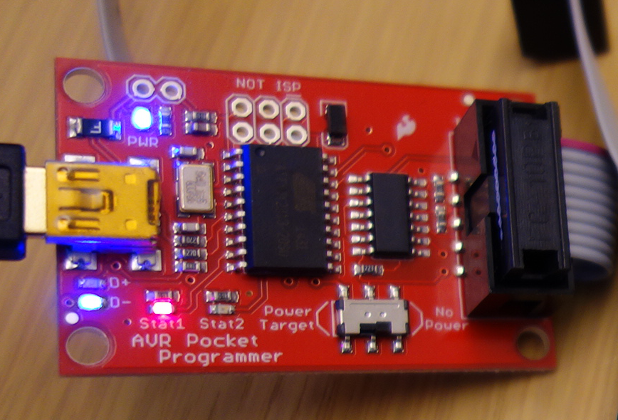
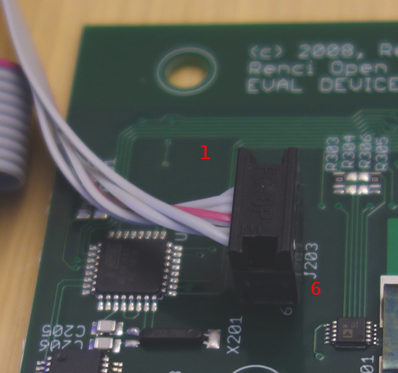
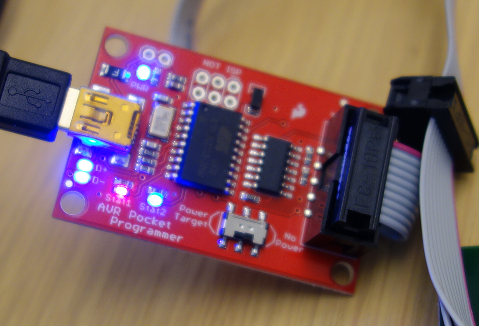
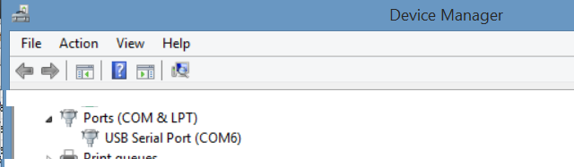
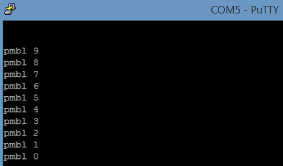
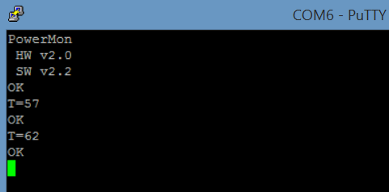

#Overview#
----------


To program PowerMon, you will need to load the bootloader first and then load the system code onto the Atmel ATMega 168A microcontroller that is on PowerMon. This requires two steps: 

1. Using a 6 pin programmer to load a bootloader onto the device. You then can verify that the bootloader is running with PuTTY or minicom. 
2. Loading the PowerMon firmware onto the the device via its USB-serial interface. 

##Background Reading:##
This firmware design and programming method is based on a series of Atmel application notes including [AVR 109: Self Programming](http://www.atmel.com/Images/doc1644.pdf "AVR 109") and [AVR 911: AVR Open Source Programmer](http://www.atmel.com/Images/doc2568.pdf "AVR 911"). The basic premise is that a bootloader is installed first, which then allows for loading further firmware via a serial interface using the PowerMon's onboard USB port as a COM port. 

Initially, Atmel Studio was used to compile and download the firmware, and these instructions are still 
included in the TODO file. However, this document uses AVRDUDE for all programming and uses the "usbtiny" programmers and "avr911 (aka AVROSP)" programmers, respectively. This is mainly because the more readily 
available pocket programmer does not work with Atmel Studio. 

#More Detailed Overview#
----------

1. On Windows, download and install WinAVR and AVRDUDE. On Linux download avr-gcc and related tools.
2. Set up the pocket programmer and connect it to the PowerMon. 
3. Compile the bootloader using the Makefile in `<Powermon-toplevel>/firmware/bootloader`
4. Compile the xtalfreq hexfile (*optional*) and powermon firmware in `<Powermon-toplevel>/firmware/system`
5. Set the fuses and then load the bootloader hexfile using the 6-pin programmer and AVRDUDE (usbtiny programmer).
6. Verify that the bootloader is working using PuTTY and by connecting to the PowerMon's USB serial connector.
7. Load the PowerMon firmware using just the PowerMon USB connection and the AVR911 programmer. 
8. Verify that the firmware is loaded with PuTTY.

#Setup and Tools#
----------

We used the Pocket AVR programmer which provides a USB mini-B interface to a 6-pin AVR In-System Programming (ISP) programmer. The design is open-sourced by SparkFun and should be available from many vendors. Note that this programmer works with any chip with less than 64KB of flash - PowerMon's microcontroller has 16 KB of flash.

[Pocket AVR Programmer PGM-09825](https://www.sparkfun.com/products/9825 "Pocket AVR Programmer")

If you have never used this type of programmer say with an Arduino, this tutorial is essential reading.

[Using the AVR Programmer (includes links to drivers)](https://learn.sparkfun.com/tutorials/pocket-avr-programmer-hookup-guide "Hooking up AVR Programmer")

The below figure shows the setup of the programmer connected to the board.


##Connecting the Programmer to the PowerMon board##

The close-up picture below shows the pocket programmer. When **Stat1** is red, this means that the board is on and detected via USB. For reading/writing operations, the **Stat2** LED should light up as well.  

There are two things to keep in mind when using the AVR programmer:

1. The AVR programmer has a "Power Target/No Target" switch that provides 5V to the board via the ISP cable. Since we have a USB power connection make sure this is switched to "No Target". This means you will have to connect PowerMon with another USB cable, but this is safer since we don't know all its required voltage specs for programming.




2. The 3x2 6-pin connector has a specific orientation - the notched side should face Pin 1 as shown in this
figure.



  


##Installing USB drivers and testing that AVRDude/USBTiny are set up correctly##
On Windows, Zadig is your best bet for installing the driver for the programmer on Windows. Linux/Mac OS X
should already have a generic USB driver installed. Once successful, the device should show up under
Device Manager.


See here for more information on Zadig:
[Windows AVR and Drivers](https://learn.sparkfun.com/tutorials/pocket-avr-programmer-hookup-guide#installing-drivers)

To test functionality with [AVRDUDE](http://www.nongnu.org/avrdude/): 

```
$avrdude -c usbtiny -p m168
avrdude.exe: AVR device initialized and ready to accept instructions
Reading | ################################################## | 100% 0.00s
avrdude.exe: Device signature = 0x1e9406
avrdude.exe done.  Thank you.
```
##Installing Compilers##

###Linux:###

[Linux AVR tools](http://www.ladyada.net/learn/avr/setup-unix.html "LadyAda AVR Tools")

Under Ubuntu you can install the proper tools using the commands:

```
sudo apt-get install flex byacc bison gcc build-essential git libusb-1.0-0 libusb-1.0-0-dev
sudo apt-get install binutils-avr gcc-avr avr-libc
```

###Windows/Cygwin:###
You will need an avr compiler, avr-gcc, which can be provided in Windows by 
[WinAVR](http://winavr.sourceforge.net/ "WinAVR"). Under Cygwin, this may show up as follows:

```
$which avr-gcc 
/cygdrive/c/WinAVR-20100110/bin/avr-gcc
```


#Compilation and Programming#
----------

###Compiling the Bootloader###
```
/cygdrive/c/GitHub/PowerMon/firmware/bootloader$ make
avr-gcc  -mmcu=atmega168 -Wall -gdwarf-2 -std=gnu99 -Os -funsigned-char
-funsigned-bitfields -fpack-struct -fshort-enums -MD -MP -MT pmbl.o -MF dep/pmbl.o.d  -c  pmbl.c
avr-gcc -mmcu=atmega168 -Wl,-Map=pmbl.map -Wl,-section-start=.text=0x3800 pmbl.o -o pmbl.elf
avr-objcopy -O ihex -R .eeprom -R .fuse -R .lock -R .signature  pmbl.elf pmbl.hex`
avr-objcopy -j .eeprom --set-section-flags=.eeprom="alloc,load" --change-section-lma
.eeprom=0 --no-change-warnings -O ihex pmbl.elf pmbl.eep || exit 0
avr-objdump -h -S pmbl.elf > pmbl.lss

AVR Memory Usage
----------------
Device: atmega168
Program:    2912 bytes (17.8% Full)
(.text + .data + .bootloader)
Data:          2 bytes (0.2% Full)
(.data + .bss + .noinit)
```

###What are all the resultant files?###
-  pmbl.elf: Sets the EEPROM, fuse lock, and loads the hex file. Program with this file! 
-  pmbl.hex: hex file to program flash
-  pmbl.eep: EEPROM programming file
-  pmbl.lss: List file - shows the assembly that will be programmed onto the chip

A really good link that talks about the compilation process can be found 
[here](http://openhardwareplatform.blogspot.com/2011/03/inside-arduino-build-process.html)


#Programming the bootloader with AVRDUDE#

## Fuses ##
Fuses are set within the device to set certain fundamental features like frequency, bootloader flash size, and start address for valid data. For instance, for PowerMon,
these values are specified as: 

-  BOOTSZ, "Boot flash size=1024 words start address=$1C00"
-  SUT_CKSEL, select first "Int. RC Osc. 8 MHz" oscillator

This [link](http://cryoarchive.net/tutorials/avr-tutorials/avr-fuses-explained/#BOOTSZ "Fuses Explained") 
demonstrates this and other fuses and basically says that we are specifying
a bootloader size of 1024 and that it starts at address 0x1C00 and also that the chip
should use an internal 8 MHz oscillator. 

###How do we convert this to something we can use with avrude?###

This [fuse calculator](http://www.engbedded.com/fusecalc/  "Fuse calculator") lets you specify these fuse values for the ATMega 168 part and provides you with the correct values for setting the low, high, and extended fuses. 

### Programming Fuses with AVRDUDE ###
**NOTE** It's ok that the last fuse programming fails here. Reading back the raw data
shows that the fuse is programmed correctly. 

```
$ avrdude -c usbtiny -p m168 -U lfuse:w:0xc2:m -U hfuse:w:0xdf:m -U efuse:w:0xf9:m

avrdude.exe: AVR device initialized and ready to accept instructions

Reading | ################################################## | 100% 0.00s

avrdude.exe: Device signature = 0x1e9406
avrdude.exe: reading input file "0xc2"
avrdude.exe: writing lfuse (1 bytes):

Writing | ################################################## | 100% 0.01s

avrdude.exe: 1 bytes of lfuse written
avrdude.exe: verifying lfuse memory against 0xc2:
avrdude.exe: load data lfuse data from input file 0xc2:
avrdude.exe: input file 0xc2 contains 1 bytes
avrdude.exe: reading on-chip lfuse data:

Reading | ################################################## | 100% 0.00s

avrdude.exe: verifying ...
avrdude.exe: 1 bytes of lfuse verified
avrdude.exe: reading input file "0xdf"
avrdude.exe: writing hfuse (1 bytes):

Writing | ################################################## | 100% 0.00s

avrdude.exe: 1 bytes of hfuse written
avrdude.exe: verifying hfuse memory against 0xdf:
avrdude.exe: load data hfuse data from input file 0xdf:
avrdude.exe: input file 0xdf contains 1 bytes
avrdude.exe: reading on-chip hfuse data:

Reading | ################################################## | 100% 0.00s

avrdude.exe: verifying ...
avrdude.exe: 1 bytes of hfuse verified
avrdude.exe: reading input file "0xf9"
avrdude.exe: writing efuse (1 bytes):

Writing |  ***failed;
################################################## | 100% 0.03s

avrdude.exe: 1 bytes of efuse written
avrdude.exe: verifying efuse memory against 0xf9:
avrdude.exe: load data efuse data from input file 0xf9:
avrdude.exe: input file 0xf9 contains 1 bytes
avrdude.exe: reading on-chip efuse data:

Reading | ################################################## | 100% 0.00s

avrdude.exe: verifying ...
avrdude.exe: verification error, first mismatch at byte 0x0000
             0xf9 != 0x01
avrdude.exe: verification error; content mismatch

avrdude.exe done.  Thank you.
```


### Programming the Bootloader with AVRDUDE ###
-----------------------------------
When the programmer is active , the Stat1, Stat2 and D+/D- lights should all
be lit.



To program the compiled hexfile onto the PowerMon flash, use the following:
`$ avrdude -c usbtiny -p m168 -U flash:w:pmbl.hex`

###Bootloader Programming Output:###
```
avrdude.exe: AVR device initialized and ready to accept instructions

Reading | ################################################## | 100% 0.00s

avrdude.exe: Device signature = 0x1e9406
avrdude.exe: NOTE: FLASH memory has been specified, an erase cycle will be performed
             To disable this feature, specify the -D option.
avrdude.exe: erasing chip
avrdude.exe: reading input file "pmbl.hex"
avrdude.exe: input file pmbl.hex auto detected as Intel Hex
avrdude.exe: writing flash (16348 bytes):

Writing | ################################################## | 100% 30.71s

avrdude.exe: 16348 bytes of flash written
avrdude.exe: verifying flash memory against pmbl.hex:
avrdude.exe: load data flash data from input file pmbl.hex:
avrdude.exe: input file pmbl.hex auto detected as Intel Hex
avrdude.exe: input file pmbl.hex contains 16348 bytes
avrdude.exe: reading on-chip flash data:

Reading | ################################################## | 100% 15.88s

avrdude.exe: verifying ...
avrdude.exe: 16348 bytes of flash verified

avrdude.exe done.  Thank you.```


##Bootloader Verification with PuTTY##

Minicom was originally used to connect to the device and check for the bootloader
"countdown", but PuTTY is easier to use cross-platform and provides enough capabilities
for verification.

First, make sure that the USB->Serial connection shows up under Device Manager in Windows
or under Linux as `/dev/ttyS<X>`. **Note** The COM port can vary so it is not likely
to always be COM6 as shown in the figure.



Connect to PuTTY with the following settings under the *Session* menu:

-  Connection Type: Serial
-  Serial Line: COM<X> (where X is found via device manager or checking /dev)
-  Speed: 1000000




What you should see is a countdown of the format "pmbl <9-0>" that will repeat. This indicates
that the bootloader has been successfully loaded.

--------
## Programming the System firmware ##
Once you have loaded the bootloader, you can actually remove the 6-pin programmer's
cable from the PowerMon. Verify that the bootloader is still running by connecting
to PuTTY again while only the USB cable is connected to the PowerMon.

AVRDUDE is again used to program the board, but now the "AVROSP" programmer is used
instead of the "usbtiny" programmer. **NOTE** Remember to use the right COM port!

`$ avrdude -c avr911 -p m168 -b 1000000 -P COM6 -U flash:w:PowerMonSystem.hex`

###System Firmware Output###
Output should look something like what follows.

```
Connecting to programmer: .
Found programmer: Id = "PMBL   "; type = S
    Software Version = 0.1; No Hardware Version given.
Programmer supports auto addr increment.
Programmer supports buffered memory access with buffersize=128 bytes.

Programmer supports the following devices:

avrdude.exe: AVR device initialized and ready to accept instructions

Reading | ################################################## | 100% 0.02s

avrdude.exe: Device signature = 0x1e9406
avrdude.exe: NOTE: FLASH memory has been specified, an erase cycle will be performed
             To disable this feature, specify the -D option.
avrdude.exe: erasing chip
avrdude.exe: reading input file "PowerMonSystem.hex"
avrdude.exe: input file PowerMonSystem.hex auto detected as Intel Hex
avrdude.exe: writing flash (6302 bytes):

Writing | ################################################## | 100% 0.81s

avrdude.exe: 6302 bytes of flash written
avrdude.exe: verifying flash memory against PowerMonSystem.hex:
avrdude.exe: load data flash data from input file PowerMonSystem.hex:
avrdude.exe: input file PowerMonSystem.hex auto detected as Intel Hex
avrdude.exe: input file PowerMonSystem.hex contains 6302 bytes
avrdude.exe: reading on-chip flash data:

Reading | ################################################## | 100% 0.91s

avrdude.exe: verifying ...
avrdude.exe: 6302 bytes of flash verified

avrdude.exe done.  Thank you.
```

##System Verification with PuTTY##

Use the same settings as before to connect to the PowerMon via PuTTY


You will initially see a blank screen. Entering `t` followed by `Ctrl-J` will
print the current system time while 'v' followed by 'Ctrl-J' will print the
version.



Now your board should be accessible via the code in the application directory that
accesses the PowerMon via USB.

#Miscellaneous#
The xtalfreq firmware can also be loaded after the bootloader, but it is strictly optional.

##Xtalfreq Compilation Output##

```
$ make
avr-gcc  -mmcu=atmega168 -Wall -gdwarf-2 -std=gnu99 -O0 -funsigned-char -funsigned-bitfields -fpack-struct -fshort-enums -MD -MP -MT xtalfreq.o -MF dep/xtalfreq.o.d  -c  xtalfreq.c
avr-gcc  -mmcu=atmega168 -Wall -gdwarf-2 -std=gnu99 -O0 -funsigned-char -funsigned-bitfields -fpack-struct -fshort-enums -MD -MP -MT usart.o -MF dep/usart.o.d  -c  usart.c
avr-gcc -mmcu=atmega168 -Wl,-Map=xtalfreq.map xtalfreq.o usart.o     -o xtalfreq.elf
avr-objcopy -O ihex -R .eeprom -R .fuse -R .lock -R .signature  xtalfreq.elf xtalfreq.hex
avr-objcopy -j .eeprom --set-section-flags=.eeprom="alloc,load" --change-section-lma .eeprom=0 --no-change-warnings -O ihex xtalfreq.elf xtalfreq.eep || exit 0
avr-objdump -h -S xtalfreq.elf > xtalfreq.lss

AVR Memory Usage:

Device: atmega168

Program:    2924 bytes (17.8% Full)
(.text + .data + .bootloader)

Data:        115 bytes (11.2% Full)
(.data + .bss + .noinit)
```

##Xtalfreq Verification Output##
TODO