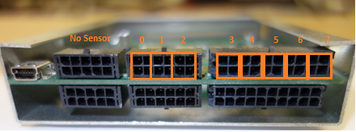
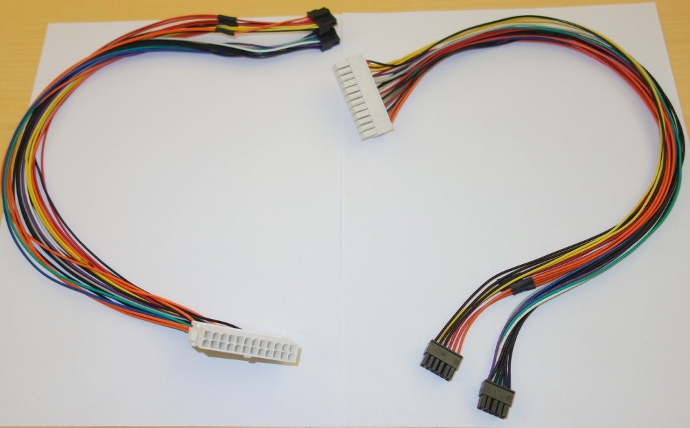
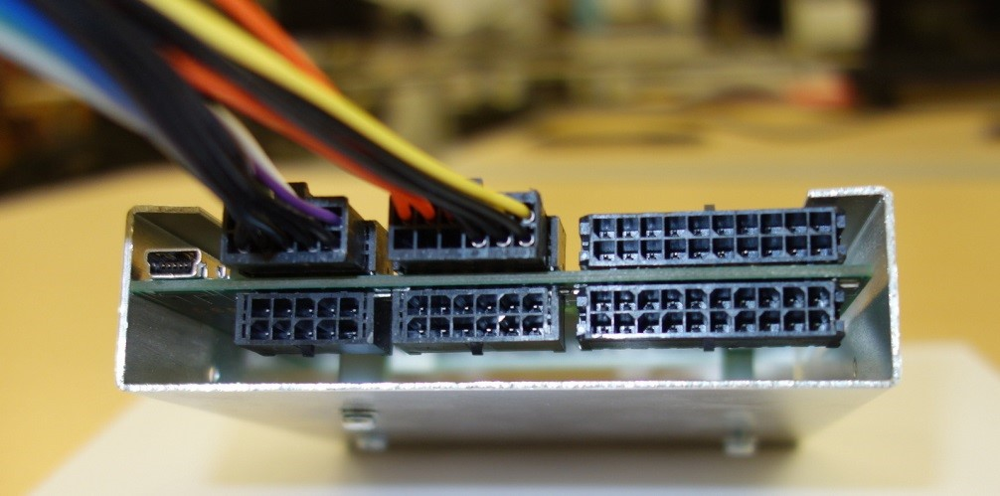
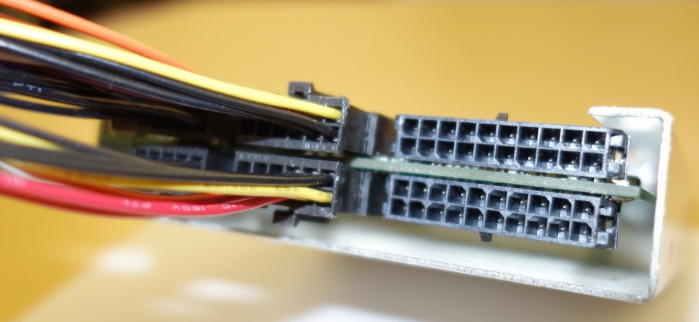
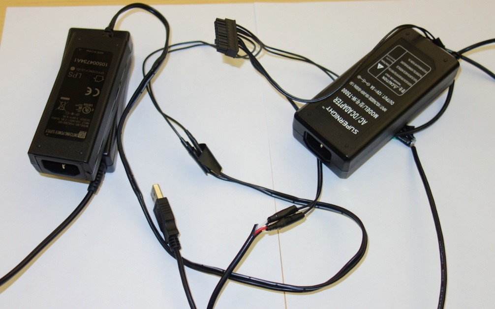
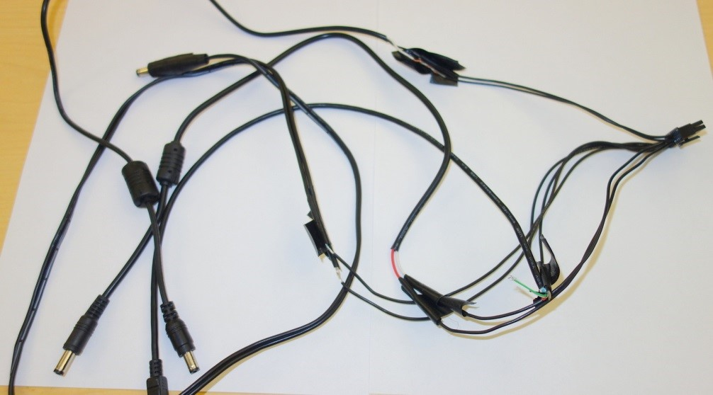
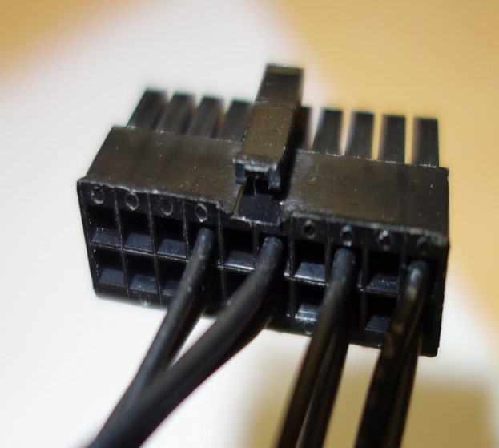
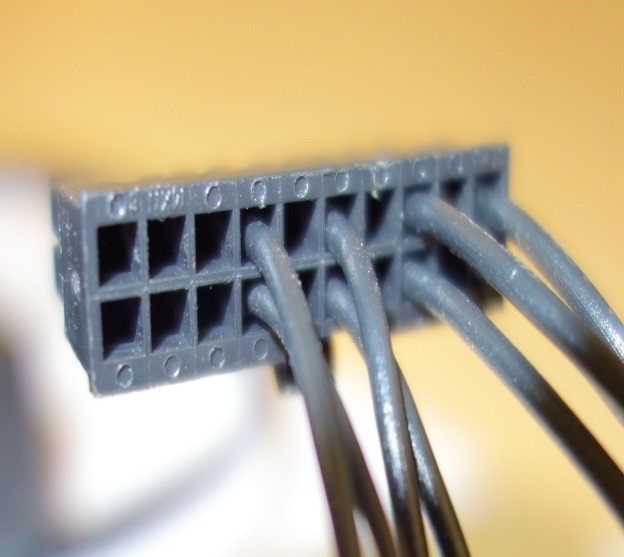
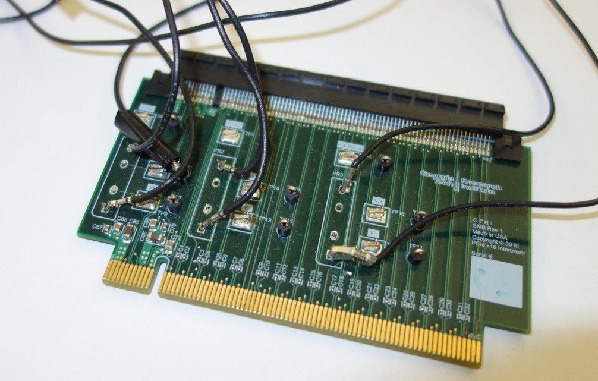
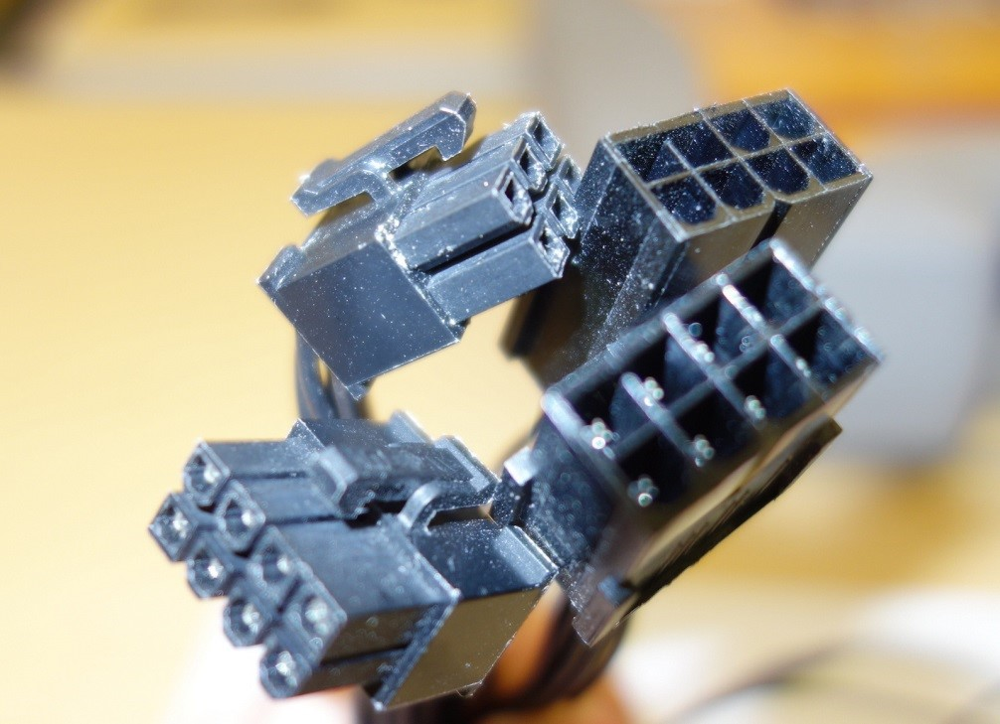

## Getting access to PowerMon designs and source code

The main repo for PowerMon is located at Dan Bedard’s Github repo at https://github.com/beppodb/PowerMon. There is a 1.0 and 1.1 version of the hardware and software. Much of the original design and knowledge that went into this project was provided by Dan, and he assisted in creating this updated documentation. Georgia Tech researchers including Jee Choi, Sara Karamati, and Jeff Young have assisted in creating this updated documentation.

Directories are as follows:

* <u>Application</u> – A simple application that initializes PowerMon and reads samples based on command-line parameters.

* <u>Assembly</u> – Instructions for adding SMT and through-hole components to the circuit board and specifications of cables used to connect devices to PowerMon. 

* <u>Firmware – Firmware that programs the onboard microcontroller; program with AVR-Dragon or AVR-Dude 

* <u>Gerber</u> – Gerber files that can be given to a PCB fab to create more PowerMon circuit boards

 * <u>PCB</u> – schematic and layout in EAGLE format

## What does the PowerMon hardware consist of? What limitations are there?

The best explanation can be found in the [PowerMon tech report](http://www.renci.org/wp-content/pub/techreports/TR-09-04.pdf) but briefly, PowerMon provides the following:

1) Inline monitoring of up to 8 DC channels for current and voltage, which means that 5 rails for a standard ATX MB can be measured along with peripherals like HDDs and PCIE cards. 3 “devices” can be measured at once, assuming there are enough pins available.

2) Higher frequency measurements (1 KHz for up to three components) that are streamed to a host PC via USB.

3) Compact design that fits in a 3.5” hard drive slot.

4) At scale, the device is relatively cheap to fab and have assembled - $250 for batches of 50 and < $500 for small batches.  In 2015, a run of 10 boards cost around $250-300 per board with assembly.

**Restrictions:**

PowerMon2 is built around a custom PCB that includes Atmel ATmega168 8-bit microcontroller connected to 8 Analog Devices ADM1191 digital power monitor chips. It does not provide total system power, and due to the specific chips it can safely measure up to 300 W on all three channels without any additional cooling. The valid range for the current and voltage sensors is 3.15V - 26V and up to 11.3 Amps.

 From Dan: "There are three factors that determine the current limit:"

- Voltage sag. This is most relevant on the 3.3V rail. The voltage cannot go below 3.15V, or the sensor will not work. For the other rails, the limit is 10%, according to the ATX spec.
- Dynamic range of the sensor. For a .005 ohm resistor, the limit is .10584/.005 = 21.168A.
- Heat dissipation of the circuit board. 11.3A may be quoted for a 20°C temperature rise.  Dan believes that you can probably exceed this safely or increase the airflow over the board to keep the temperature low.

***\**For measuring a high-end GPU, the safest bet is to just measure that separately from other components since these devices can use up to 250 W.\***

## How does PowerMon differ from Watts Up? How about PowerInsight?

**Watts Up?** is generally used to measure system power and is designed to measure standard 120 V electrical connections. PowerMon has a much higher measurement resolution than Watts Up?, 1 KHz vs. 60 Hz, and it allows for the measurement of circuits at a smaller granularity (for instance ATX rails vs input at the power supply). PowerMon also streams measurement values via a USB cable to a host PC while Watts Up stores results in an onboard memory of limited size. 

https://www.wattsupmeters.com/secure/index.php

**PowerInsight** is a more recent hardware tool developed at Sandia. PowerInsight uses Hall effect transducers to measure current without needing to be inline with the circuit, providing more accurate results with less interference. The main disadvantage of this infrastructure is that it is not an open-source design and it can only be purchased in certain configurations of Penguin Computing servers.  PowerInsight also can do thermal measurements using sensors placed directly on a component (say a CPU). 

Link: http://www.sandia.gov/~jhlaros/Laros_23_PowerInsight.pdf

Another good paper that talks about Watts Up? vs. Hall Effect Transducers can be found in “Goel, et al, Chapter two – Techniques to Measure, Model, and Manage Power, Advances in Computers, November 2012”.

http://www.sciencedirect.com/science/article/pii/B978012396528800002X

**WattProf** is another recent (~2015) hardware project for power measurement that has been productized by RNET ([see here](http://www.rnet-tech.com/index.php/projects/18-pwr-mon-proj)) and is described in a 2015 CLUSTER paper, "WattProf: A Flexible Platform for Fine-Grained HPC Power Profiling".

## How to build PowerMon hardware

PowerMon is an open-sourced project released via RENCI open source license, which means that the PCB layout, schematic, and Gerber files are available online along with assembly instructions. You can review the schematic using EAGLE, found at http://www.cadsoftusa.com/download-eagle/

To build a new PowerMon device you will need to do the following:

1)   Get a quote from a PCB manufacturer for fab of the PCB by providing them with the Gerber files (gerber directory in Github repo). If you don’t want to attach the components yourself, then you should request a turnkey assembly quote and provide a list of the components in assembly/v1.0/powermon-bom.ods. 

2)   Either get a quote for the cables specified in assembly/v1.1/pm-cablea.ods and assembly/v1.1/pm-cableb.ods or buy the components and a Molex micro-connector crimper. 

3)   Once you have received the board you will need to program the firmware. There is a separate document that discusses how to do this under “docs/Firmware”.

## How to build cables for use with PowerMon

This is somewhat out of the scope of this document, but you should be able to find good guides on building 6-pin and 8-pin cables. Look for guides on "custom sleeving for PC cables" or something similar - there are many good YouTube videos on creating custom color-coded GPU, ATX, and SATA cables.

If you don't want to build your own cables, you can also take an existing extension cable (say an ATX or SATA extender) and cut it in half and connect the appropriate voltage inputs to the PowerMon.

## How to check the version of and program PowerMon firmware

Connect to the PowerMon port with Minicom at 1MB/s and send "v<lf>" (where <lf> is a line feed. ctrl-j in minicom or PuTTY). That will show you the hardware and firmware version number according to https://github.com/beppodb/PowerMon/blob/master/firmware/system/powermon.c.

## How to hook up devices to PowerMon

The figure below shows the location of the sensors on PowerMon. Each pair of pins is connected together and the leftmost connector is just used as a passthrough connector. It is normally used with the ground/neutral pins for an ATX connector as shown below in the next section. 

The sensor input traditionally goes into the top set of female plugs while the output goes into the bottom set of female plugs. Note that the left hand set of plugs is mostly used for devices like ATX cables, which might need some passthrough connection but do not need to be measured.

### ATX motherboard power:

 

ATX motherboard power is measured using “Cable A” specified in Github under the assembly folder, and there is one white female and male connector.

 

 

### CPU power:

We don't have any pictures of CPU cable adapters, but you would measure the 12V power cable used for auxiliary CPU power. CPU socket power is best measured with tools like [RAPL](https://en.wikipedia.org/wiki/Perf_(Linux)#RAPL) and APIs like [PAPI](http://icl.cs.utk.edu/papi/).

### AC Power adapters:

Power Brick outputs from Powermon – three different power bricks and a USB power output.  Note that we have cut the cables so that we can create custom Molex plugs that measure the voltage and current for the wires within these plugs.

DC Power Brick sensor connectors for use with PowerMon – note that each sensor uses two pins. In this case, we have connected multiple power bricks to one Molex plug. Depending on the device being tested, we just looked at the output for the sensors. From the example above, this plug supports reading from sensors 4,5,6, and 7 on the PowerMon.

 

### PCIe:

### 
                                                                                                         
To measure PCIe power requires 3 sensors and a PCIe interposer card. The card for our infrastructure has been designed by a local lab at Georgia Tech Research Institute and has measurement points for the two 3.3V and 12V rails.

### 

 

PCIe 6 and 8 pin power sensors are used to measure the power for auxillary power separately.

## How to check the firmware version and update it

You can connect to the PowerMon port with minicom (or screen which includes minicom functionality) at 1MB/s and send `v<lf>` (where `<lf>` is a line feed or possibly `CTRL-J`). That will show you the hardware and firmware version number according to https://github.com/beppodb/PowerMon/blob/master/firmware/system/powermon.c .

## How to compile and run the PowerMon application

Ideally use a different system to host the USB connection to reduce interference

`<program_exe> <port_dev> <mask> <sample_pd> <num_samples>`

The following example samples sensor 6 at 1 KHz for approximately 4 seconds (4000 samples). 

`$./run_powermon /dev/ttyUSB0 6 1024 4000`

## How to reduce interference from included system components

The best way to do this is to remove any extraneous components in your system! Note that for ATX power, you are unlikely to be able to separate some on-board power consumption, so it may be easiest to unplug untested devices (network cards, untested GPUs, extra memory). You may also be able to use BIOS settings to disable some onboard components. 
